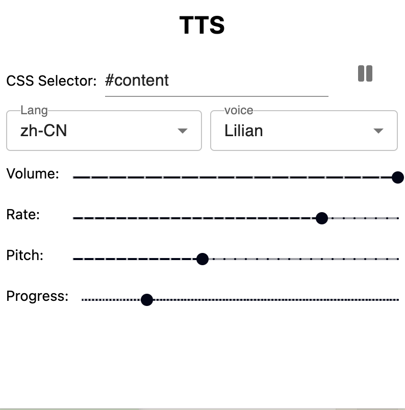

# Chrome-TTS

Read selected text by using Web Speech API.

## Usage

### Popup Panel

### Settings:
- CSS Selector: selects the content text which will transfer to speech.
- [voice](https://developer.mozilla.org/en-US/docs/Web/API/SpeechSynthesisUtterance/voice)
- [volume](https://developer.mozilla.org/en-US/docs/Web/API/SpeechSynthesisUtterance/volume)
- [rate](https://developer.mozilla.org/en-US/docs/Web/API/SpeechSynthesisUtterance/pitch) 
- [pitch](https://developer.mozilla.org/en-US/docs/Web/API/SpeechSynthesisUtterance/pitch)
- Progress: the speech progress of the whole selected text.

### Steps:

1. select dom element which contains text content by setting CSS Selector.
2. select lang and voice.
3. start play.
